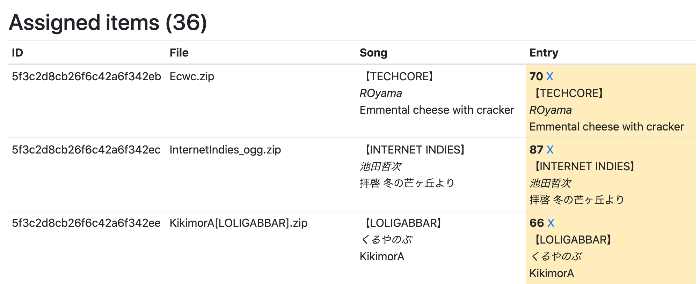

# bmsurge-rebooted

The scripts and infrastructures that are used to operate the
[Be-Music Surge](https://be-music.surge.sh) non-stop BMS radio station.

## About the reboot

Be-Music Surge was previously unmaintained for 2 years. The reason that I got
unmotivated to maintain the radio station is because it took me a lot of time
and effort to process a BMS event for inclusion in the radio station. For
example, it took about 2 minutes to render a single BMS archive. That means
processing a big event means I need to run it overnight, while processing a
smaller event can still takes hours, which is not practical to do often. Also, I
originally built Be-Music Surge by stringing many tools together. For example,
music is being streamed by the [Music Player Daemon](https://www.musicpd.org)
which maintains its own music database. Getting it to play songs the way I want
means writing even more code to synchronize between the file storage, MPD’s song
database, and the station’s own database.

Fast-forward for two years, we now have
[Google Cloud Run](https://cloud.google.com/run/) which lets me run compute
tasks (such as rendering the BMS archive to MP3) on Google’s cloud
infrastructures. The most important feature is that I can run hundreds of tasks
simultaneously and get billed by the number of seconds I’m using the service.
With this, now I can render 100 hours of music, and I only have to wait for 20
minutes!

I also built [shouter](https://github.com/bemusic/shouter), a simple application
that requests the next song to play via a JSON-based HTTP endpoint, and then
streams that song to the Icecast server. It doesn’t maintain any database. Due
to this decoupled nature, the shouter client, the song files, the song database,
and the code that manages the playlist can all be run on different providers for
most ease-of-use and cost-effectiveness.

- The shouter client runs on the same
  [DigitalOcean (referral link)](https://m.do.co/c/302d31171899) machine that
  runs Icecast. That machine doesn’t have enough storage space to store all the
  songs, though.

- The music files are stored in
  [Google Cloud Storage](https://cloud.google.com/storage/). Tasks running on
  Cloud Run can write to Cloud Storage without hassle, making it the ideal
  storage target. However, the bandwidth cost is expensive. Therefore, the
  storage contents is mirrored to [Feral Hosting](https://www.feralhosting.com)
  to save bandwidth costs.

- The song database is hosted on
  [MongoDB Atlas](https://www.mongodb.com/cloud/atlas) which has a free tier.
  This means I don’t have to manage a database server myself.

- The playlist management code is run on
  [Cloud Functions for Firebase](https://firebase.google.com/docs/functions), so
  that I don’t have to manage or deploy any server here. This also makes it very
  easy for me to deploy and update the playlist management code by just running
  `firebase deploy`.

## Components

### song database

The song database runs on MongoDB.

### song storage

The rendered song files are stored on Google Cloud Storage.

### [worker](worker)

A service on Cloud Run that downloads a BMS archive from a URL, renders it into
MP3, and uploads it to Google Cloud Storage.

### [manager](manager)

Manages the song database and invokes the worker when new BMS songs need to be
processed.

## Management

This section describes how I manage the radio station, such as adding new songs
to the library. This assumes that all components set up already.

- **Download the BMS package.** I would download an BMS Event’s package. I
  usually do this on a seedbox, because there are more storage on there and the
  network speed is much better.

  - For Google Drive links, I use the
    [`gdrive_download`](https://gist.github.com/darencard/079246e43e3c4b97e373873c6c9a3798)
    script.

  - For Dropbox links, I just use plain ol `wget`.

  - For other links that needs manual downloads, I use a cloud VPS to download
    the package (via remote desktop) and then transfer it over to the seedbox.

- **Extract the BMS package.** I need to repack the BMS package into
  one-zip-file-per-song format. So first, I have to extract the whole package.

  - For `.rar` or `.7z` archive, I use the `7z` command-line tool. This kind of
    archives are pretty easy to work with, since they have better support for
    Unicode file names.

  - For `.zip` archive, this is a bit tricky because the files may be encoded in
    an arbitrary encoding (most frequently CP932). To add to the offense, the
    encoding used is not stored in the zip file’s header and decompression tools
    doesn't provide a switch to specify the encoding.

    For this I use `bsdtar` to first extract the files: `bsdtar xvf <file>.zip`.
    I use it because it doesn't attempt to convert the filename’s encoding. It
    treats the file name as binary string, and writes it as-is to the file
    system.

    Then, I use `convmv` to fix the encoding issue:
    `convmv -f CP932 -t UTF-8 -r .`. `convmv` is actually pretty smart, and will
    skip converting filenames if it is already in utf-8 encoding.

- **Re-package as one-song-per-zip-file archives.** Given the extracted files in
  the directory `raw` (relative to the current working directory), I run this
  Ruby script to put them in `zip`.

  ```ruby
  require 'pathname'
  require 'open3'

  files = Dir.glob("raw/**/*.{bms,bme,bml,bmson,pms}", File::FNM_CASEFOLD | File::FNM_EXTGLOB)
  dirs = files.reject { |f| Dir.exist?(f) }.map { |f| File.dirname(f) }.uniq
  dirs = dirs.reject { |d| dirs.any? { |e| d.start_with?(e + '/') } }
  dirs.sort!

  def make_temp_name
    Pathname.new('tmp').mkpath
    Pathname.new('tmp').join("tmp-#{Time.now.to_f}.zip").to_s
  end

  class Task
    def initialize(in_dir)
      @in_dir = in_dir
    end
    def output
      'zip/' + @in_dir.sub(/^raw\//, '').gsub('/', '__') + '.zip'
    end
    def to_s
      "Converting #{@in_dir} => #{output}"
    end
    def run!
      if !File.exist?(output)
        Pathname.new(output).parent.mkpath
        temp = make_temp_name
        # , "-mx=0"
        system "7z", "a", temp, "./#{@in_dir}/*" or raise "Task #{self} failed: 7z error"
        system "mv", temp, output or raise "Task #{self} failed: mv error"
      end
    end
  end

  tasks = dirs.map { |d| Task.new(d) }
  tasks.each_with_index do |t, i|
    puts "[#{i + 1}/#{tasks.length}] #{t}"
    t.run!
  end
  ```

- **Make the zip file downloadable.** Each ZIP file will need a public URL. I do
  this by symlinking the `zip` directory to the `public_html` directory on the
  seedbox.

- **Generate a URL list.** I then create a `.json` file with the list of URLs to
  import. For example, `mutualfaith3.urls.json` would look like this:

  ```json
  [
    "https://<seedbox-host>/bms/mutualfaith3/5C01-aberrant_sorcery.zip",
    "https://<seedbox-host>/bms/mutualfaith3/Aradia.zip",
    "https://<seedbox-host>/bms/mutualfaith3/Balam_katastrophe%5BOverKill%5D.zip",
    ...
  ]
  ```

- **Import the URLs into the song database.** Inside `manager` I run:
  `node src/index.js import -f <event>.urls.mp3`

- **Perform the batch rendering.** These are done in `manager` folder.

  - First I run `node src/index.js work -f` to process the new songs.

  - Some songs will fail to render the first time but will do just fine the
    second time. Run `node src/index.js work -f --retry` to attempt re-rendering
    failed songs.

  This will account for more than 95% of the songs. The are few songs that needs
  to be fixed manually.

- **Perform manual (per-song) rendering.** I run `node src/index.js server` (in
  another terminal tab) to open a web server with a UI that lets me inspect the
  rendering result. I go to `http://localhost:8080/#/event/<event>`

  It will show the songs that are not rendered.

  

  - To render them on the cloud, I run `node src/index.js work -f -s <song_id>`.

  - Due to Google Cloud Run’s memory limitation (of 2 GB), some songs will fail
    to render because they require more than 2 gigabytes of RAM to process. To
    fix this I have to run a renderer worker locally (`./scripts/run server` in
    `worker`) and then `node src/index.js work -f -s <song_id> --local`.

- **Adding event metadata.** I use MongoDB VS Code extension and open a MongoDB
  Playground. Then I run a MongoDB Shell script to insert new event information.
  The entries can be scraped from the venue site using
  [Data extration scripts](https://github.com/bemusic/bmsurge-rebooted/wiki/Event-data-extraction-scripts)
  posted on the wiki.

  ```js
  use('bmsurge')
  db.events.insertOne({
    _id: 'mutualfaith3',
    date: '2020-08-02',
    title: 'Mutual Faith 3',
    url: 'https://revlishsart.wixsite.com/mutualfaith3',
    entries: [...]
  })
  ```

- **Rendered-song-to-entry matching.** We want to display links to the
  corresponding BMS submission entries in the venue when we play it on the
  radio. So we need to match each rendered song to an entry in the BMS venue.

  With the management server open, I can see the songs that needs matching in
  **Unassigned items** section. The **Available entries to match** number
  verifies that the event metadata (the previous step) is properly entered to
  the database (otherwise it displays 0).

  

  To speed up this process, I can click on the **Auto-match** button to match
  the BMS header data to the entry automatically.

  In this example I can now see that 36 entries out of 39 are matched properly,
  while 3 are not and require manual matching.

  

  Non-matching happens when the metadata in the BMS headers does not match the
  metadata in the venue. Maybe they are spelled differently or have “(BMS Edit)”
  added to the title.

  Once everything is matched up, I can click the **Save changes** button to save
  everything to the songs database.

- **Synchronize the rendered songs to the seedbox.** The renderer worker script
  start the rendered files in Google Cloud Storage. However, there are costs
  associated with bandwidth these files from the radio station. To reduce the
  operation costs, I synchronize the files from Google Cloud to my seedbox, and
  configure the radio broadcast to stream songs from the seedbox instead.
  `gsutil -m rsync -d gs://bmsurge-renders/ public/mp3/`

- **Update the songlist on the radio station.** To keep things decoupled (and to
  save costs), the broadcasting system (`dj`) does not read from the database
  directly. It said it has an internal songlist which must be updated when we
  update the song library.
  `node src/index.js songlist --update -o private/_songlist.json`

- **Update the search index.** This allows songs to be requested.
  `node src/index.js songlist --index='2020-08-01T00:00:00.000Z' --update`

- **Update the server status.** I run a script that reads the song list and
  updates the server status accordingly. The source code for that script is not
  in this repository yet.
